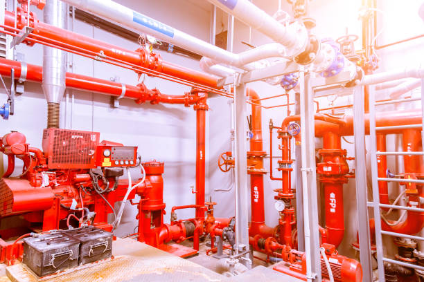

## Fire Detection & Alarm Systems

Our Fire Detection and Alarm Systems are designed to provide **early warning, rapid response, and reliable control** in the event of a fire incident.

### Scope of Services
- Smoke, heat, flame, and multi-criteria detectors
- Addressable and conventional fire alarm panels
- Audible and visual alarm devices
- Emergency notification and evacuation systems

### Engineering & Compliance
All systems are designed and installed in compliance with **NFPA, FM Global, and local fire authority requirements**, ensuring full regulatory approval.

### Application Areas
- Industrial plants
- Oil & gas facilities
- Commercial buildings
- Data centers and critical infrastructure

